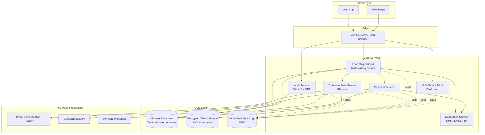
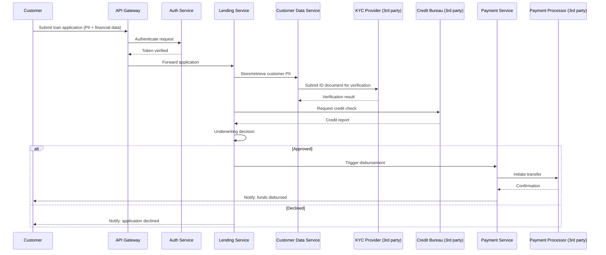

# Architecture & Data Flow

## System Architecture

## Data Flow: Loan Application to Disbursement

## Reasoning

**Why route everything through a single API Gateway?** It gives one enforcement point for authentication, rate limiting, and request logging, rather than each service needing to independently implement these, which is where inconsistencies (and security gaps) tend to creep in.

**Why is Customer Data Service separated from Lending Service?** PII and KYC documents have different sensitivity and different compliance obligations (data subject rights, retention limits) than transactional loan data. Separating them means access to one doesn't automatically grant access to the other, and each can have its own, narrower access control policy.

**Why does Payment Service never talk to Customer Data Service directly?** Payment processing only needs a disbursement account reference, not full customer PII. This is a data minimization decision: the service with the widest external exposure (talking to a third-party payment processor) has the narrowest possible view of sensitive data.

**Why is there a centralized audit log fed by every service?** Multi-tenant systems need a single place to answer "who accessed what, when" across tenant boundaries, especially important for incident response and for demonstrating control effectiveness to an auditor.
